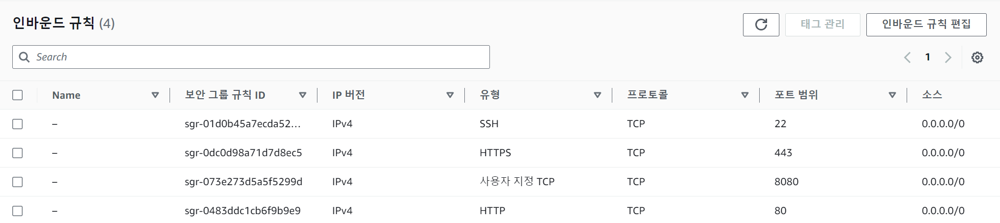
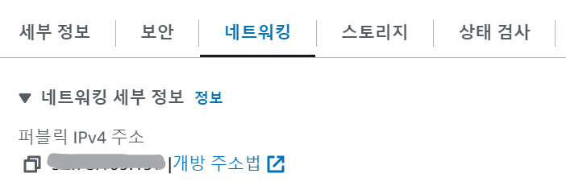

## 1. EC2 Instance 생성

- Instance Name: `cowork-front`
- OS Image: `Ubuntu`
- Storage: `30GiB`
- pem 키 경로 `C:\Cloud\cowork-front.pem`

## 2. 보안그룹 편집

- 기존 `ssh` 외의 `http`, `https` 추가
- 서비스 사용시 사용할 `8080 port`도 추가



## 3. SSH를 이용한 EC2 Instance 접속

- Window의 경우, 기본 cmd가 아닌 `GitBash`로 접속
- 키페어(.pem)을 원하는 경로에(C:/Cloud) 복사
- 아래 명령어로 접속 > yes/no 선택 시 yes 선택

`ssh -i [pem key 경로]/[pem key 이름.pem] [운영체제]@[public IPv4 주소]`
```
#현재 예시
ssh -i C:/Cloud/cowork-front.pem ubuntu@[퍼블릭 IPv4 주소]   #[퍼블릭 IPv4 주소]는 xx.xx.xxx.xxx의 10자리 수
```



## 4. Ubuntu 환경 구축

### 1. npm 환경 구축

- node.js와 npm 설치 -NVM 사용

```
#NVM 설치
curl -o- https://raw.githubusercontent.com/nvm-sh/nvm/v0.35.3/install.sh | bash
nvm --version   #nvm 버전확인 

##node&npm 설치
nvm install 14.4.0
```

- **nvm not found 오류 해결**
    - 1. `touch ~/.zshrc`로 파일 생성
    - 2. `vi ~/.zshrc`로 들어가서 아래 코드 입력 후 `:wq`로 저장 종료
    ```
    export NVM_DIR="$HOME/.nvm"
    [ -s "$NVM_DIR/nvm.sh" ] && \. "$NVM_DIR/nvm.sh" # This loads nvm
    ```
    - 3. `source ~/.zshrc` 로 스크립트 실행

- 설치 확인
```
node -v
npm -v
npm vue -v
```

### 2. git clone으로 github에서 배포할 파일 가져오기

### 3. 서버 배포

1. Front

- git clone으로 받은 파일은 git에 올라온 이름으로 폴더 생성 
    - 해당 폴더로 들어가서 실행해야함
    - 본 폴더명은 `front`
```
cd front
npm i   #npm install의 약자. package.json 에 포함된 의존성 패키지 일괄 설치
npm run serve
```

- `[퍼블릭 IPv4 주소]:8080`로 접속

2. Back - node.js

```
cd [파일명]
npm i
npm start
```