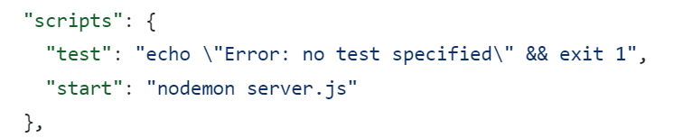

## 도입 목적
- AWS EC2를 사용해 배포하는데, EC2에 직접 접속해 실행시켜야만 서버가 동작
    - EC2와 접속되어있는 터미널을 종료하거나 컴퓨터를 종료하면 서버 중단
- EC2 콘솔을 종료하더라도 서버가 계속 실행되도록 `무중단 배포` 도입

## Nodejs

1. EC2 접속

2. PM2 설치

`npm install pm2 -g`

3. PM2 사용

- 아래 명령어로 실행 파일을 백그라운드에서 실행시킬 수 있음
- nodejs의 실행 파일을 모르는 경우, `package.json` 파일의 "start"에 존재하는 파일이 실행파일
    - 아래 사진의 경우 실행파일이 `server.js`



`pm2 start [실행파일명]`
```
 pm2 start server.js
```


## SpringBoot

1. 